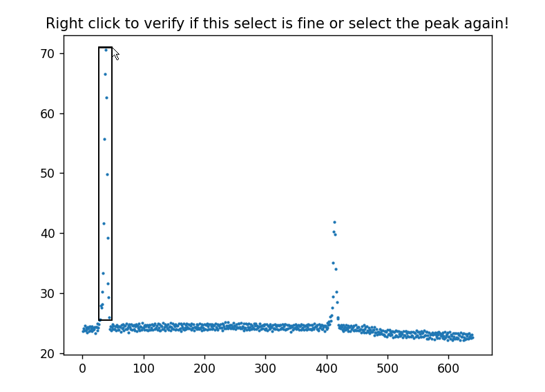
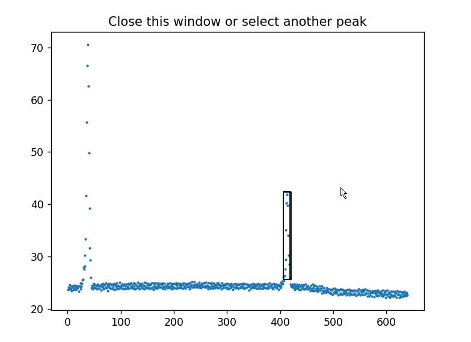
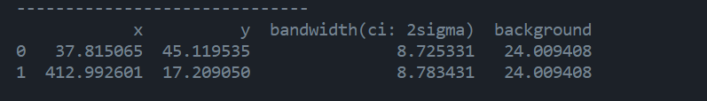

# <b>Interactive Scipy Curve_fit</b>
A Python project enables you to fit peaks interactively on GUI.
You can visualize your spectrum and fit the optional number of the peaks on GUI using Scipy.optimize.curve_fit method.

## <b>How to use?</b>

Try [how_to_use.py](how_to_use.py) with your spectrum data!

## <b>Spectrum data format must be like the table below</b>

| x | y |
|---|---|
|0  | 1  |
|1  | 13 |
|2  | 30 |
|3  | 43 |
|4  | 31 |
|5  | 11 |
|...|...|

## <b>Features</b>

1. Making the initial guess of each peak position on GUI

    ### Initial Guess method
    - mouse-dragging (wrap up peak area by mouse-dragging)
    - click (click the top and the both edges of each peaks)

    ### Screenshot
    
    
    
    

1. Fitting peaks data with guessor results as the init fitting functions
    
    ### Supported fitting functions
    - gaussian function
    - polynomial function

    ### Output information includes
    - position (x, y) of each peaks
    - baseline height of the spectrum
    - bandwidth of each peaks with its CI (confidential interval)

## <b>Supported supectrum file format</b>

- ascii file(.asc .csv .txt etc..)
- bmp image(.bmp .jpg .png .jpeg etc..)

    excel sheet files, table of html are planed to be suported in the near future.

## <b>Features that are planned to be supported!</b>

- baseline correlation
- other fitting functions (e.g. binomical distribution function)
- automated guessor method using wavelet transform and CNN